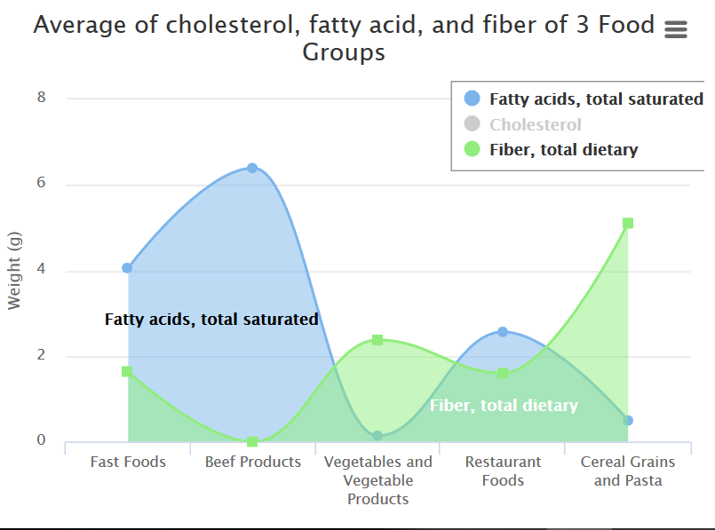

<h1 align="center">
   
  USDA Food Composition Data Visualization
   
</h1>
<h2 align="center">
   
  Erma Safira Nurmasyita 13516072
   
</h2>
<h2 align="center">
   
  Abstrak
   
</h2>
Pada eksplorasi visualisasi data ini, kami menganalisis kandungan nutrisi sejumlah kelompok makanan. Tujuan dari analisis ini adalah untuk mengamati karakteristik kandungan nutrisi setiap kelompok makanan. Data nutrisi makanan standar diperoleh dari lembaga USDA Amerika Serikat.

## USDA Food Composition
[USDA](https://ndb.nal.usda.gov/ndb/) (United States Department of Agriculture) merupakan lembaga pemerintah Amerika Serikat di bidang agrikultur. Lembaga USDA menyediakan database nutrien sejumlah makanan. Standar pengukuran makanan merupakan 100 gram. 

## Analisis
Kami melakukan scraping data sebanyak 2395 data makanan beserta kandungan nutrisi dan kategorinya. Kandungan nutrisi dihitung secara standard pada takaran sebesar 100 gram. Data Diperoleh enam kategori utama dengan persentase sebagai berikut:

    
Pada database USDA, data terbanyak berasal dari produk agrikultur berupa buah dan sayuran. Kemudian produk olahan snack, minuman, dan makanan cepar saji berada pada urutan nomor dua terbanyak.

Untuk setiap kategori utama, berikut merupakan kandungan makronutriennya (proximates):

Dari chart di atas, diperoleh rata-rata kandungan karbohidrat, protein, gula, dan lemak masing-masing kategori dalam satuan gram. Dapat diperoleh informasi bahwa produk gandum memiliki kandungan karbohidrat yang paling banyak, disusul dengan snack, minuman, dan masakan restoran. Sesuai ekspektasi, produk olahan daging memiliki jumlah kandungan karbohidrat paling sedikit, namun berprotein paling tinggi. Kandungan lemak terbanyak terdapat pada kategori lainnya, yang terdiri dari minyak dan lemak, makanan bayi, produk ikan laut, dan produk Amerika India.

## Kandungan Protein dan Energi

Berikut merupakan pemetaan energi(kcal) dengan jumlah protein(g) dari tiga makanan pokok (sayuran, buah-buahan, dan daging).

Dari chart di atas, produk sayuran rata-rata memiliki kandungan protein sebanyak 0-10 gram dengan energi yang disimpan sebesar 0-200 kcal. Buah dan produk olahan buah memiliki kandungan yang tidak berbeda jauh dengan sayuran, (0-5 gram protein dan 0-400 kcal energi). Sedangkan pada produk olahan daging memiliki kandungan protein tinggi (> 5 gram) dan menyimpan energi yang cenderung lebih besar.

<h2 align="center">
   
  Kandungan Lemak Jenuh dan Kolesterol
   
   
</h2>

Dari data diperoleh rata-rata kandungan kolesterol pada 100 gram produk daging adalah 73 gram. Disusul dengan kandungan pada makanan cepat saji dengan besar setengahnya dan makanan restoran sebesar 30 gram. Sayuran dan sereal gandum memiliki kandungan kolesterol terrendah.

Kandungan lemak jenuh terbesar dimiliki produk olahan daging, makanan cepat saji kemudian makanan restoran. Sedangkan kandungan serat terbesar dimiliki kelompok sereal gandum, kemudian sayuran.

## Kandungan Air
Berikut merupakan rata-rata kandungan per kategori, dari terbesar hingga terkecil:

1. Sayuran dan Buah-buahan = 73.18 gram
2. Olahan daging = 60.3 gram
3. Olahan unggas = 56.9 gram
4. Lainnya (masakan Amerika Alaska, seafood, sup, saus) = 55.3 gram
5. Snack, minuman, fast food = 49.2 gram
6. Olahan gandum = 22.2 gram

## Kesimpulan
Dari analisis ini diharapkan dapat menambah pengetahuan khususnya dalam menyusun program penyesuaian konsumsi per hari. Kemudian juga dapat dijadikan standar perencanaan konsumsi masyarakat secara masif.