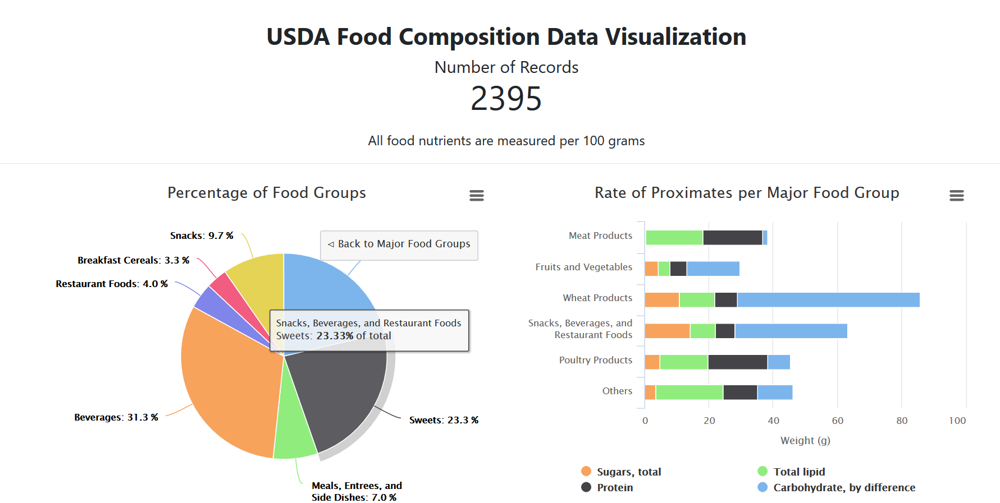

<h1 align="center">
  <br>
  Tugas 2 Seleksi Basis Data 2018
  <br>
  <br>
</h1>

<h2 align="center">
  <br>
  USDA Food Composition Data Visualization
  <br>
  <br>
</h2>

This program is a dashboard for data visualization of nutrients food standard from [USDA Food Databases](https://ndb.nal.usda.gov/ndb/).

### Tools
1. HighchartsJS
2. USDA Food Composition Scraper

### How to Run
To access main dashboard, open `dashboard.html` on your browser.

### Screenshot


### Specifications
1. Tugas dikerjakan secara berkelompok dengan pembagian anggota yang dapat diakses pada link berikut: [Pembagian Kelompok Tugas 2](https://docs.google.com/spreadsheets/d/1rmLotmW_yk60mK78awBMLF9fTukAXSWLmQl1fVkHYn8/edit?usp=sharing).

2. Setiap kelompok diminta untuk membuat sebuah dashboard interaktif yang memvisualisasikan data hasil scraping pada tugas 1. Data atau topik yang digunakan boleh memilih salah satu dari topik-topik anggota kelompok __ATAU__ mengkombinasikannya.

3. Tools dan bahasa yang digunakan dalam membuat dashboard tidak dibatasi.

4. Dalam pengerjaan tugas, setiap kelompok melakukan fork project github berikut: https://github.com/wargabasdat/Seleksi-2018-Tugas-2. Sebelum batas waktu pengumpulan berakhir, calon warga basdat harus sudah melakukan pull request dengan nama ```TUGAS_SELEKSI_2_[nim anggota 1]_[nim anggota 2]_[nim anggota 3]```

5. Pada repository tersebut, setiap kelompok juga diminta membuat sebuah artikel yang berisi hasil analisis dari data yang dipilih. Dari dashboard lakukan analisis data secara visual. Hasil analisis ini kemudian dilengkapi dengan analisis statistik yang sifatnya wajib dan machine learning (tidak wajib). Dari proses analisis kemudian ditarik kesimpulan.

6. Artikel ini dibuat dalam format .md menggunakan Markdown Language yang dibuat sekreatif mungkin dengan penamaan file ```ARTIKEL_[nim anggota 1]_[nim anggota 2]_[nim anggota 3].md```

7. Deadline pengumpulan tugas adalah __4 Agustus 2018 Pukul 23.59__

<hr>
<h3 align="center">
  <br>
  Erma Safira Nurmasyita - 13516072
  <br>
  Adyllan Roaffa - 13516019
  <br>
</h3>
